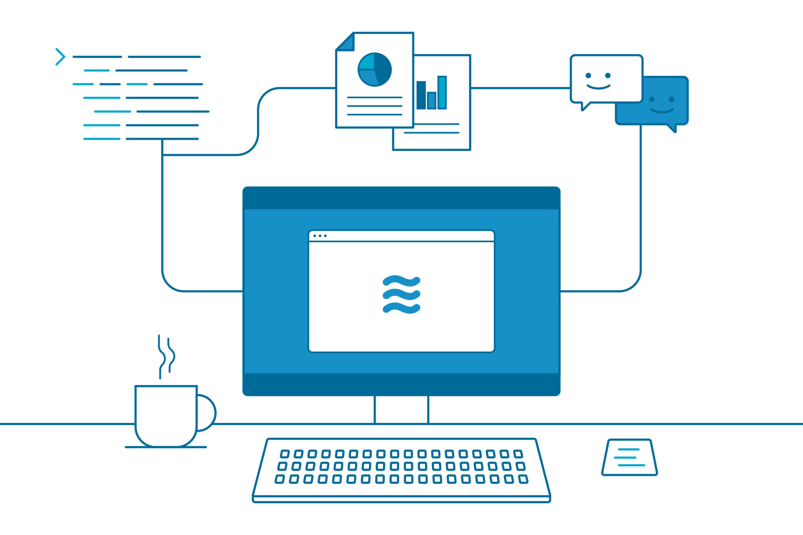
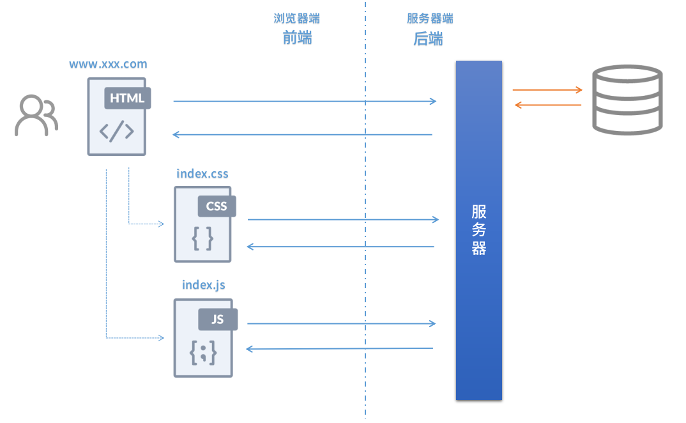
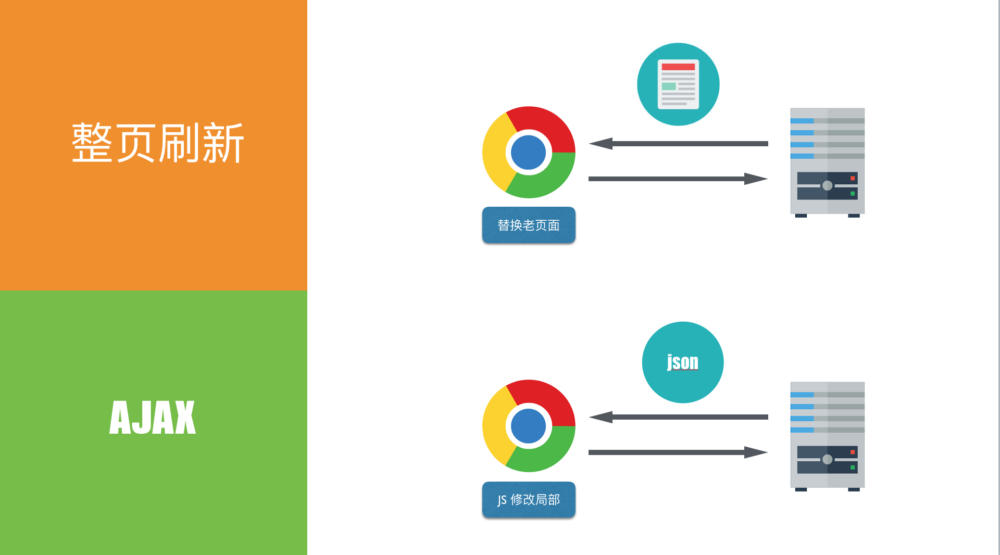

# Ajax 与 Fetch



## Ajax 

> Ajax：Asynchronous JavaScript and XML （异步 JavaScript 和 XML）

Ajax 是我们进行页面实时更新，乃至实现前后端分离架构的基础，在没有大规模使用 Ajax 之前，我们的访问站点时的数据交互如下（如果你今天访问的是纯静态页面，也是如下交互）：



在这种交互模式下，浏览器与服务器的每次交互都需要重新请求页面：像 JSP/PHP 等后端渲染的方案，这些模板渲染引擎会把用户所需数据填入静态模板，然后后渲染为 HTML 文档返回给浏览器显示。前后端完全以文档交互数据，用户做表单提交等操作都需要跳转到新页面/路径[^1] ，用户体验很差。

[^1]: 这也是在 SPA 前后端分离架构出现后，前端需要路由组件的原因：路径已经不再被后端控制。

而在现代 web APP 中，以 Ajax 和 Fetch 为代表的无刷新异步处理方案，已经将我们的交互方式变成了如下：



可以看到对于纯前端渲染的单页应用[^2]来说，除了首屏渲染以外，后续用户与后端接口的所有交互都是传输 JSON 数据，这样用户提交表单等操作不会刷新整个页面，体验更接近原生 APP；另一方面也减少了网络传输文件大小，也降低了服务器压力（后端不再渲染模板，压力分散到了各浏览器客户端）。

[^2]: 某些单页应用，为了首页性能或SEO优化等目的，使用了部分后端渲染技术，由后端返回的是已经填入了数据的HTML文档。

在浏览器端 Ajax 通过 XHR （XMLHttpRequest）对象来执行异步请求，XHR 是微软最早在 IE 下设计的标准，后来加入了 W3C 标准，我们一般很少直接使用 XHR，而是使用 jQuery 或其他专门的 Ajax 封装库，需要注意如果网站要兼容 IE6，我们应该使用 ActiveXObject 对象（再次感谢过去的那些年里， jQuery 为我们屏蔽了这些差别）。

**参考资料**

[XMLHttpRequest 文档]: https://developer.mozilla.org/zh-CN/docs/Web/API/XMLHttpRequest
[Ajax 文档]: http://www.runoob.com/ajax/ajax-intro.html

## Fetch

Ajax 的实现基础 XMLHttpRequest 已经提出很多年了，存在很多历史问题，如上面从参考链接中 MDN 官方文档中列出了很多 XMLHttpRequest 提供的接口，这些接口中有很多本身设计就有问题，已经陆续被废弃，这对我们的日常使用造成了许多困扰。Ajax 长久以来没有解决的一个问题是“callback hell”：当我们发起的多个异步请求存在先后次序要求时，我们的代码不是传统的“纵向增加”，而是“横向生长”。

```javascript
// callback hell
getData(function(x) {
  getMoreData(x, function(y) {
    getMoreMoreData(y, function(z) {
      ...
    });
  });
});
```

可以看到我们的代码在向下生长的同时，也在快速向右生长，甚至会让代码超出屏幕的宽度，这降低了代码的可读性。同时依靠 callback 的异步处理方式，对于异常的处理很不友好，我们无法使用正常的 catch/throw 的方式来处理错误，如下捕获 jQuery 封装的 Ajax 异常的写法是无效的：

```javascript
// 这样无法捕获异常
try {
  $.Ajax({
        type: "POST",
        url: someurl,
        contentType : "text/xml",
        data: somedata,
        success: function(data,status,xhr){
            alert("get it!");
        },
    });
} catch(error) {
  ..
}
```

很明显，try-catch 只能捕获同步的（在同一栈）上的错误，而 callback 并不运行在栈上，我们只能用 jQuery 或 JavaScript 提供的指定回调函数来处理错误情况。

而改用 Fetch 后我们可以这样实现我们的逻辑：

```javascript
// Fetch
fetch('www.xx.com/api')
	.then(taskA(value))
	.then(taskB(value))
	...
    .catch(onRejected(error));
```

当然我们使用 ES7 规范中的 async/await 后，我们更可以进一步用同步的代码处理异步的逻辑：

```javascript
async () => {
   try {
    const response = await fetch(url);
    const data = response.json();
    if(data.status === 0) { // 请求结果正常
	  const response2 = await fetch(url2);
      const data2 = response2.json();
      console.log("final data:", data2);
    }
  } catch(e) {
    console.log("error:", e);
  } 
}
```

如上，当我们有两个异步请求，且只有在第一个请求成功时才继续第二个异步请求处理，我们完全用同步的代码就完成了这段逻辑，同时我们可以正常用 try-catch 处理异步情况。

Fetch 底层基于 Promise 实现，关于 Promise 我会在单独章节详细说明：Promise 其实是函数式编程范式的一种实践。

Fetch 本身提供了 Headers、Request、Response 三个接口，这与现代 HTTP 协议中的概念保持一致，如果你有过 Nodejs/Go 等后端开发经验的话，你会发现这些语言的 HTTP 处理接口也是这样的，经过重新设计的 Fetch 明显比 Ajax 更容易理解和配置。现在大多数现代浏览器都已经支持 Fetch，我们也确实不太需要那些 Ajax 封装库。

此外，Fetch API 对 CORS 跨域资源访问的设置更标准，只要在 header 中进行相关设置就可以实现跨域请求，相关情况可以参见《跨域处理》章节。

当然相比 Ajax，Fetch 也有许多不足：比如 Fetch 不能在请求时间过长等情况下手动 abort 请求；根据 Promise 规范的定义，现在使用 Fetch 做文件上传等耗时请求时，我们无法获得时时进度（而 Ajax 可以通过 [XMLHttpRequest.upload](https://developer.mozilla.org/zh-CN/docs/Web/API/XMLHttpRequest/upload) 提供的指定事件来获得）。以上两种场景不是特别常见，日常开发中我还是建议使用更现代的 Fetch 方案。

## 参考链接

- [前端的异步解决方案之Promise和Await/Async](https://scq000.github.io/2016/11/05/%E5%89%8D%E7%AB%AF%E7%9A%84%E5%BC%82%E6%AD%A5%E8%A7%A3%E5%86%B3%E6%96%B9%E6%A1%88%E4%B9%8BPromise%E5%92%8CAwait-Async/)
- [Fetch API](https://developer.mozilla.org/zh-CN/docs/Web/API/Fetch_API)


